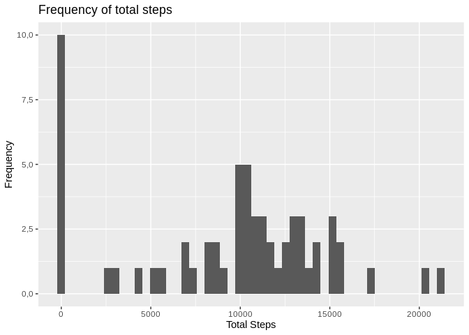

## Loading and preprocessing the data

```r
source("utils.R")
```

```
## 
## Attaching package: 'dplyr'
```

```
## The following objects are masked from 'package:stats':
## 
##     filter, lag
```

```
## The following objects are masked from 'package:base':
## 
##     intersect, setdiff, setequal, union
```

```r
data <- load_data()
```


## What is mean total number of steps taken per day?

```r
data_per_day <- get_total_steps_per_day(data)

ggplot(data_per_day, aes(x = total_steps)) +
    geom_histogram(bins = 50) +
    ggtitle("Frequency of total steps") +
    xlab("Total Steps") +
    ylab("Frequency")
```

```
## Warning: Removed 8 rows containing non-finite values (stat_bin).
```

<!-- -->

```r
overall_mean <- mean(data_per_day$total_steps, na.rm = TRUE)
overall_median <- median(data_per_day$total_steps, na.rm = TRUE)
```

- The mean value for the total steps per day is 1,0766189\times 10^{4} and the median 10765.


## What is the average daily activity pattern?

```r
data_per_interval <- get_mean_per_interval(data)

ggplot(data_per_interval, aes(x=interval, y=mean_value)) +
    geom_line() +
    ggtitle("Average number of steps by interval") +
    xlab("Interval") +
    ylab("Number of steps")
```

<!-- -->

```r
max_interval <- (data_per_interval %>%
                    filter(mean_value == max(mean_value)))$interval
```

- The maximum number of steps is in interval 835.


## Imputing missing values

```r
data_no_na <- impute_data_with_median(data)
data_per_day_no_na <- get_total_steps_per_day(data_no_na)

total_missing_values <- sum(is.na(data$steps))
total_zero_values <- sum(data$steps==0, na.rm = TRUE)
ggplot(data_per_day_no_na, aes(x = total_steps)) +
        geom_histogram(bins = 50) +
        ggtitle("Frequency of total steps") +
        xlab("Total Steps") +
        ylab("Frequency")
```

<!-- -->

```r
overall_mean_no_na <- mean(data_per_day_no_na$total_steps)
overall_median_no_na <- median(data_per_day_no_na$total_steps)
```

- There are 2304 missing values.
- Missing values were replaced by the median of each day.
- With imputed values, the mean value for the total steps per day is 9354,2295082 and the median 1,0395\times 10^{4}.
- Imputing missing values with the value zero (median individual value) makes both, the mean and the median of the total number of steps, decrease because the number of observations increases but no value was added.


## Are there differences in activity patterns between weekdays and weekends?

```r
data_per_interval_and_type <- mean_by_day_type(data_no_na)

ggplot(data_per_interval_and_type, aes(x = interval, y = mean_value)) +
        geom_line() +
        facet_grid(type ~ .) +
        ggtitle("Plot steps-interval by day type") +
        xlab("Interval") +
        ylab("Number of steps")
```

<!-- -->
